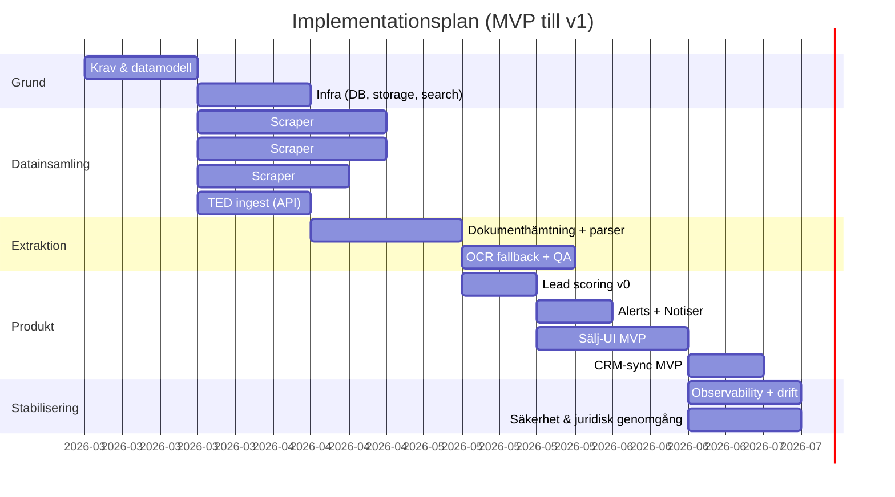

# Upphandling av kollektivtrafik och samhällsbetalda resor i Sverige

## Executive summary

Svensk kollektivtrafik upphandlas i praktiken i ett flernivåsystem där **regionerna via regionala kollektivtrafikmyndigheter (RKM)** är huvudbeställare för linjelagd lokal och regional trafik (buss, tåg, spår, tunnelbana och båt), medan **kommunerna** typiskt är huvudansvariga för **skolskjuts** och delar av **färdtjänst**, och staten genom **Trafikverket** kontrakterar “transportpolitiskt motiverad interregional kollektivtrafik” när marknaden inte bär kommersiellt. citeturn16search2turn31search0turn32search14

Upphandlingsregimen är **blandad**: busstrafik upphandlas ofta i en miljö där **LUF och förhandlade förfaranden är vanliga**, medan kollektivtrafik på järnväg/tunnelbana/vatten i större utsträckning kopplas till EU:s kollektivtrafikförordning och kompletterande svensk reglering. citeturn15view0turn16search0turn16search2turn16search17 Samtidigt är “samhällsbetalda resor” (serviceresor) — t.ex. **färdtjänst, riksfärdtjänst, sjukresor och skolskjuts** — en mycket stor volymmarknad med egna avtals-/indexfrågor och ofta en beställningscentral som nav för samordning. citeturn22view0turn29view0turn1search0turn1search1

Marknaden på utförarsidan är koncentrerad i busstrafik. För 2015 redovisas exempelvis marknadsandelar i upphandlad busstrafik mätt i kontraktsbetalningar, där Nobina och Keolis var störst, följt av Arriva och ett antal regionala/lokala aktörer (siffror är historiska och bör ses som en indikation på struktur, inte en realtidsbild). citeturn8view0 Upphandlingsprocessen är i grunden en standardiserad offentlig inköpsprocess (förbereda–genomföra–realisera), men i trafikavtal är dokumentationen, riskallokeringen (brutto/netto/incitament), indexering och mobiliseringskrav ofta avgörande för kvalitet och konkurrensutfall. citeturn32search0turn13view1turn15view0

För att identifiera affärsmöjligheter systematiskt (t.ex. för Hogias produktprofil inom realtids-/trafiklednings-/dataplattformar) är det praktiskt att bygga ett bevaknings- och analyslager ovanpå Sveriges **registrerade annonsdatabaser** och EU TED, kompletterat med operatörs- och regionportaler. En viktig datapunkt är att merparten av annonserade upphandlingar i Sverige går via ett fåtal registrerade annonsdatabaser (Mercell Annonsdatabas, e‑Avrop och KommersAnnons stod tillsammans för i princip hela volymen 2023). citeturn33search3turn34view0turn33search11

## Styrning, huvudmän och ansvarsfördelning

### Förvaltnings- och beställarkedjan

Sverige har **21 regioner** och **290 kommuner**. citeturn10search0turn10search1 Kollektivtrafikens beställarlandskap kan beskrivas som tre huvudspår:

**Regional nivå (RKM och länstrafikbolag):** Lagen om kollektivtrafik knyter regionala roller till EU:s kollektivtrafikförordning och anger att det ska finnas behöriga myndigheter som kan besluta om allmän trafikplikt och därigenom upphandla subventionerad trafik. citeturn16search2turn16search0turn8view1 I praktiken sker organiseringen ofta genom en kombination av regionförvaltning och/eller regionalt trafikbolag; exempel på stora beställarorganisationer som ofta lyfts är trafikförvaltningen i Stockholms län, Västra Götalandsregionens organisation och Region Skånes struktur med tillhörande trafikvarumärken. citeturn13view0turn13view2

**Kommunal nivå (skolskjuts och delar av serviceresor):** Kommunerna har ett explicit ansvar att anordna skolskjuts i grundskolesystemet och relaterade skolformer; skolkommunen anordnar och hemkommunen ersätter kostnader enligt Skolverkets sammanställning av skollagsregler. citeturn31search0 För gymnasiala elevresor finns dessutom särskild lagstiftning om kommunernas ansvar för vissa elevresor. citeturn31search1

**Statlig nivå (interregional tillgänglighet):** Sedan 2011 ingår det i Trafikverkets uppgifter att verka för grundläggande tillgänglighet i interregional kollektivtrafik när kommersiella förutsättningar saknas; myndigheten tecknar trafikavtal för tåg-, flyg- och busstrafik samt färjetrafik till Gotland och kostnaden uppgår till cirka 1 miljard kronor per år. citeturn32search14 Trafikverket använder även samverkansavtal där en eller flera RKM upphandlar själva trafiken och staten delfinansierar ett “basutbud”. citeturn32search10

### Särskilda persontransporter och serviceresor

I branschtermer används ofta “serviceresor” som samlingsbegrepp för samhällsbetalda, ofta anropsstyrda resor. En branschsammanställning anger att medlemmar i Svensk Kollektivtrafik (RKM och länstrafikbolag) årligen hanterar omkring **86 miljoner sådana resor** och att ansvaret kan ligga helt eller delvis hos dem beroende på hur kommuner och regioner överlåtit uppgifter enligt färdtjänst- eller kollektivtrafiklag. citeturn22view0

De centrala delmängderna och deras primära regelverk/ansvarspunkter är:

- **Färdtjänst:** regleras i lag (1997:736). Den anger också att kommun/region kan överlåta sina uppgifter enligt lagen till den regionala kollektivtrafikmyndigheten. citeturn1search0  
- **Riksfärdtjänst:** regleras i lag (1997:735). citeturn1search1  
- **Sjukresor:** regleras i lag (1991:419) om resekostnadsersättningättning vid sjukresor, och SKR beskriver att sjukvårdshuvudmannen (region) själv bestämmer grunder för ersättning och egenavgifter inom ramen för regelverket. citeturn30search0turn30search15  
- **Skolskjuts:** kommunalt ansvar enligt skollagen, sammanställt av Skolverket. citeturn31search0  

En praktiskt viktig observation för upphandling är att regionerna ofta organiserar sjukresor som **anordnade resor via beställningscentral och upphandlade transportörsavtal**. En branschrapport för 2024 anger exempelvis att mer än 7,5 miljoner sjukresor gjordes, med en snittkostnad om 430 kr/resa och att 80% av sjukresorna var anordnade via beställningscentraler och centrala transportörsavtal. citeturn29view0

### Statliga myndigheter och systemaktörer som påverkar upphandling

Utöver huvudmännen påverkas kollektivtrafikupphandling av ett antal funktionella roller i staten och branschens gemensamma infrastruktur:

- **Tillsyn och statistik över upphandling:** entity["organization","Konkurrensverket","procurement authority se"] är registermyndighet för registrerade annonsdatabaser, utövar tillsyn och håller ett annonsdatabasregister. citeturn34view0turn33search19 entity["organization","Upphandlingsmyndigheten","swedish procurement agency"] är statistikmyndighet och driver statistikdatabas, samt tillhandahåller process- och rättsmedelsstöd. citeturn34view0turn32search0  
- **Reglering av trafikutbudsdata:** entity["organization","Transportstyrelsen","swedish transport agency"] föreskriver bl.a. att trafikutbudsdata enligt kollektivtrafiklagen ska lämnas till entity["company","Samtrafiken i Sverige AB","national pt data hub se"] och att det normalt ska ske senast 21 dagar före start/ändring/upphörande. citeturn24view0  
- **Branschsamverkan kring avtalsmallar och index:** entity["organization","Partnersamverkan för en förbättrad kollektivtrafik","swedish pt collaboration"] tillhandahåller modellavtal, kravbilagor och vägledningar för buss, tåg, serviceresor och skolskjutsupphandling. citeturn25search16turn25search19  

## Aktörslandskap och marknadsstruktur

### Utförare i linjelagd kollektivtrafik

Ett kunskapsunderlag om svensk busstrafik beskriver att det finns cirka **350 kontrakt** som reglerar busstrafiken i Sverige (över 95% av all busstrafik) och att det finns cirka **90 bussoperatörer** verksamma. citeturn13view2turn13view0 Samma källa lyfter en “toppgrupp” av operatörer (baserat på nettoomsättning 2014) och betonar att marknaden rymmer många mindre aktörer vid sidan av de stora. citeturn13view0

För marknadsandelar i upphandlad busstrafik finns en redovisning (mätt i kontraktsbetalningar för 2015) där marknadsandelarna för de största bussbolagen framgår; den visar tydlig koncentration men också en “lång svans” av regionala/lokala aktörer. citeturn8view0

| Bussbolag (upphandlad busstrafik) | Marknadsandel (2015, kontraktsbetalningar) |
|---|---:|
| Nobina | 23,8% |
| Keolis | 18,9% |
| Arriva | 8,5% |
| entity["company","Buss i Väst AB","bus operator se"] | 6,5% |
| entity["company","Veolia Transport","transport operator brand"] | 5,0% |
| entity["company","Nettbuss","bus operator nordic"] | 3,8% |
| entity["company","Bergkvarabuss","coach operator se"] | 2,8% |
| entity["company","Västerås lokaltrafik","public transport operator se"] | 1,9% |
| entity["company","Gamla Uppsala Buss","bus operator se"] | 1,9% |
| Transdev | 1,6% |
| entity["company","Centrala Buss i Norrbotten","bus operator se"] | 1,1% |

Källa: tabell redovisad i en rapport om konkurrens i upphandlad kollektivtrafik. citeturn8view0

**Analytisk tolkning:** Tabellen är tidsatt till 2015 och ska inte läsas som en aktuell marknadsandel 2026. Däremot är den användbar för att förstå att upphandlad busstrafik historiskt haft en hög koncentration i toppen, vilket i sin tur påverkar upphandlingsstrategi (paketering av trafikområden, inträdesbarriärer, fordonskrav och riskallokering). citeturn8view0turn13view2

### Utförare inom serviceresor

Serviceresor är ofta ett ekosystem av:

- beställare (region/kommun eller delegerad RKM),
- **beställningscentral** (tjänst och IT),
- transportörsavtal (taxi, specialfordon, småbuss, ibland buss),
- samordningslogik (samkörning, slingor, prioriteringsregler).

Att beställningscentraler och centrala transportörsavtal är centrala illustreras av att en branschrapport anger att 80% av sjukresor är anordnade via beställningscentraler och centrala avtal. citeturn29view0

### IT- och systemleverantörer i kollektivtrafikens informationskedja

Kollektivtrafikens IT-leverantörslandskap kan delas i tre lager:

**Trafikdata och standarder:** entity["company","Trafiklab","public transport data platform se"] publicerar bl.a. NeTEx-dataset och entity["company","Samtrafiken i Sverige AB","national pt data hub se"] beskriver NeTEx som en EU-standard för statisk data (tidtabeller, hållplatser, priser) och att Samtrafikens publicerade data på Trafiklab i dag följer en nordisk NeTEx-profil. citeturn17search2turn17search10

**Operational control & realtidssystem:** Hogia beskriver sin plattform som en dataplattform för planerad trafik och realtidsinformation som stödjer appar, webb och skyltar, samt verktyg för trafikledning och förare. citeturn6search1turn17search13 Företaget har även kommunicerat nya integrationer mot Trafikverket för realtidspositioner för tåg. citeturn6search15

**Kommunikation/fordonsplattformar:** Som exempel på en annan leverantörsroll har ett system för fordonskommunikation (uppbyggt efter ITxPT-standard) beskrivits i en upphandling/leverans till en svensk region. citeturn17search19

### Branschorganisationer och avtalsstöd

En central mekanism i svensk kollektivtrafikupphandling är att branschen tillsammans tagit fram **modellavtal, vägledningar och indexrekommendationer**. citeturn25search16turn25search3 Det senaste modellavtalet för bussupphandling (2023) har bilagor/komponenter som t.ex. prisbilaga, trafikbeskrivning, miljöbilaga, Bus Nordic samt personuppgiftsbiträdesavtal och bedömningsgrunder för kundupplevd kvalitet. citeturn27view0turn25search2

För serviceresor är indexfrågan särskilt viktig. Branschen har kommunicerat en övergång från Taxiindex till “indexkorg för serviceresor” eftersom SCB slutar ta fram Taxiindex efter 2025. citeturn25search14turn25search27

## Upphandlingsprocess, regelverk och avtalsmodeller

### Översikt av styrande regelverk

Upphandling av kollektivtrafik sker inom ramen för flera parallella regelverk:

- **EU:s kollektivtrafikförordning (EG) nr 1370/2007** reglerar bl.a. hur avtal om allmän trafik ska tilldelas och innehåller exempelvis maxlängder för avtal (10 år för busstransporter, 15 år för järnväg/spår). citeturn16search0turn16search8  
- **Svensk kollektivtrafiklag (2010:1065)** kompletterar EU-regleringen och anger nationella bestämmelser för behöriga myndigheter. citeturn16search2turn16search22  
- **LOU/LUF/LUK** är de centrala upphandlingslagarna för offentliga kontrakt och koncessioner; tröskel- och direktupphandlingsgränser uppdateras och för 2026 finns dokumenterade nivåer per lag. citeturn11search1turn11search2  

En viktig gränsdragning som explicit lyfts i förarbeten är att tjänstekontrakt för kollektivtrafik med buss och spårvagn uttryckligen ska tilldelas enligt LOU-/LUF-direktivens bestämmelser, medan vissa andra trafikslag (och koncessioner) hanteras enligt EU:s kollektivtrafikförordning kompletterat av nationella regler. citeturn16search17

### Steg-för-steg: från behov till driftstart och avtalsförvaltning

entity["organization","Upphandlingsmyndigheten","swedish procurement agency"] beskriver inköpsprocessen i tre huvudsteg: **förbereda**, **genomföra** och **realisera**. citeturn32search0 För kollektivtrafik uppstår praktiskt ofta en mer detaljerad kedja:

1) **Behovs- och målbild**: trafikförsörjningsprogram, allmän trafikplikt, kapacitets- och kvalitetsmål. citeturn16search2turn13view2  
2) **Marknadsanalys och dialog**: för att förstå leverantörsbas, teknikskiften och möjliga lösningar; UHM beskriver marknadsanalys och leverantörsdialog som en viktig del av förberedelsefasen. citeturn32search26  
3) **Strategi för paketering och risk**: trafikområden, fordonsansvar, depåfrågor, incitament, indexering, och särskilt i serviceresor: samordnings- och beställningscentralupplägg. citeturn13view1turn29view0  
4) **Upphandlingsförfarande och annonsering**: i kollektivtrafik är “förhandlat förfarande” enligt en branschvägledning det mest vanliga förfarandet och får alltid användas när LUF tillämpas (även om faktisk förhandling inte alltid sker). citeturn15view0  
5) **Anbudsfas (Q&A, sekretess, utvärdering)**: utvärdering sker mot kvalificeringskrav och tilldelningskriterier; förhandlade upplägg får inte avse minimikrav eller tilldelningskriterier enligt vägledningen. citeturn15view0  
6) **Tilldelningsbeslut och avtalsspärr**: tilldelningsbeslut ska bl.a. ange skäl och informera om avtalsspärr (minst 10 dagar). citeturn32search1turn32search2  
7) **Kontraktsimplementering och avtalsförvaltning**: UHM lyfter vikten av att realisera avtal genom implementering, förvaltning och uppföljning samt att utvärdering bör innehålla analys av måluppfyllelse och leverantörens kravuppfyllelse. citeturn32search11turn32search0  

**Tidsdimensioner:** Ett kunskapsunderlag om busstrafik beskriver att upphandlingsprocessen för ett trafikavtal ofta är lång, med initialt informationsmöte och att ett förfrågningsunderlag kan presenteras ungefär ett år efter första kontakt. citeturn13view0 Därtill tillkommer mobilisering (fordon, personal, depå, IT) som i praktiken gör att trafikavtal ofta planeras med god framförhållning.

### Direktupphandling och tröskelvärden

För 2026 redovisas bl.a. följande nivåer:

- **Direktupphandling enligt LOU:** 700 000 kr (varor/tjänster och bygg), och 8 513 250 kr för sociala och andra särskilda tjänster. citeturn11search1turn11search2  
- **Direktupphandling enligt LUF:** 1 200 000 kr (varor/tjänster och bygg), och 11 351 000 kr för sociala och andra särskilda tjänster. citeturn11search1turn11search2  

För samhällsbetalda resor kan klassificeringen (tjänst, social/särskild tjänst, försörjningssektor m.m.) bli styrande för vilket regelverk och vilken tröskel som slår.

### Avtalsmodeller: brutto, netto och incitament

Ett etablerat sätt att analysera kollektivtrafikavtal är riskallokeringen mellan beställare och operatör:

- **Bruttokontrakt:** biljettintäkter tillfaller beställaren; operatören ersätts för kostnader och produktion. Källan beskriver detta som den vanligaste kontraktsformen för lokal och regional kollektivtrafik i Sverige. citeturn13view1  
- **Nettokontrakt:** biljettintäkter tillfaller operatören, ofta med kompletterande ersättning; syftet är att ge operatören intäktsincitament, men utfallet beskrivs som omtvistat. citeturn13view1  
- **Incitamentskontrakt:** intäkter tillfaller beställaren men operatören får incitament kopplat till resande eller kvalitetsvariabler; källan beskriver flera varianter som används i Sverige. citeturn13view1  

För serviceresor uppstår dessutom en “ekonomimodell” i form av **ersättningslogik per resa/zon/tid** kombinerat med samordningskrav och en indexmekanism (t.ex. branschens indexkorg). citeturn25search4turn25search14

### Vanliga bilagor och kravspecifikationer

Branschens bussmodellavtal (2023) illustrerar vilka bilagetyper som ofta återkommer i trafikupphandling:

- prisbilaga,
- trafikbeskrivning,
- miljöbilaga,
- Bus Nordic (funktionskrav för bussar),
- personuppgiftsbiträdesavtal (SKR),
- bedömningsgrunder för kundupplevd kvalitet. citeturn27view0  

Dessa bilagor fungerar ofta som “kärndata” för både anbudskalkyl, utvärdering och senare avtalsuppföljning.

## Potentiella kunder för Hogia

### Produktprofil som styr kundmatchning

Hogia beskriver lösningar som hanterar **planerad trafikdata**, **realtidsinformation** och **trafikledning** och som kan förse appar, webb och skyltar med information samt ge förare och trafikledare gemensam lägesbild. citeturn6search1turn17search13 Bolaget har också kommunicerat integrationer mot Trafikverkets data för att visa tågens faktiska position i realtid, vilket indikerar fokus på dataintegration och kundnära reseinformation. citeturn6search15

Samtidigt finns explicita svenska kund-/upphandlingsreferenser, bl.a. leveranser efter upphandling till Region Västmanland samt leverans till Region Kronoberg och ett uppdrag till Svealandstrafiken. citeturn6search13turn6search19turn6search16

### Matchningstabell

Skalan “fit” här är en **säljorienterad bedömning** (hög/medel/låg) baserad på (a) typ av roll (huvudman/operatör), (b) sannolik praktisk nytta av realtids-/dataplattformar i deras trafik/serviceresor, och (c) indikationer på tidigare relationer eller typiska behov. Den är inte en ersättning för kundintervju eller teknisk förstudie.

| Namn | Roll | Fit | Motivering |
|---|---|---|---|
| entity["state","Region Västmanland","region se"] | Huvudman/beställare | Hög | Dokumenterad upphandling/leverans av trafikinformationssystem. citeturn6search13 |
| entity["state","Region Kronoberg","region se"] | Huvudman/beställare | Hög | Dokumenterad upphandling/leverans av komplett trafikinformation inkl. molnbaserad trafikledning. citeturn6search19 |
| entity["company","Svealandstrafiken","regional pt company se"] | Beställare/operativ trafikledning | Hög | Dokumenterad investering/leverans av trafikledningssystem för bussflotta (initialt 150 bussar). citeturn6search16 |
| entity["company","Västtrafik","public transport authority se"] | Huvudman/beställare | Hög | Indikation på långvarig drift/leverans av Hogia PubTrans (partnerskap kommunicerat). citeturn6search10turn6search17 |
| entity["company","Skånetrafiken","public transport authority se"] | Huvudman/beställare | Medel–hög | Indikation på samarbete kring trafikinformation (kommunicerat), och stor komplexitet i gränsöverskridande info. citeturn17search33 |
| entity["state","Region Stockholm","region se"] | Huvudman/beställare | Medel | Mycket stor trafikvolym och komplexitet gör dataplattform/realtid relevant, men sannolikheten påverkas starkt av befintlig systemarkitektur och långa kontrakt. citeturn13view0turn16search8 |
| entity["state","Västra Götalandsregionen","region se"] | Huvudman/beställare | Medel–hög | Stor beställarroll och historik av branschgemensamma datamodeller/avtal; hög systemkomplexitet. citeturn13view0turn25search19 |
| entity["state","Region Skåne","region se"] | Huvudman/beställare | Medel | Samma motiv som ovan: stor trafik och serviceresor; fit beror på befintliga plattformsval. citeturn13view0turn22view0 |
| entity["state","Region Uppsala","region se"] | Huvudman för linje + serviceresor | Medel | Serviceresor är strategiskt viktiga och ofta kopplade till beställningscentral/avtal; plattformsstöd kan vara relevant. citeturn22view0turn29view0 |
| entity["state","Region Jämtland Härjedalen","region se"] | Huvudman/beställare | Medel | Indikerad investering i fordonskommunikationsplattform enligt ITxPT-standard antyder digitaliseringsagenda. citeturn17search19 |
| entity["state","Region Västerbotten","region se"] | Huvudman/beställare | Medel | Stor geografi och interregional koppling gör samordning och informationsstöd viktigt. citeturn32search10turn29view0 |
| entity["state","Region Norrbotten","region se"] | Huvudman/beställare | Medel | Liknande motiv: gleshet, interregionala samband och serviceresor. citeturn32search10turn22view0 |
| entity["state","Region Halland","region se"] | Huvudman/beställare | Medel | Standardiserade bilagor och branschmodeller gör upphandling av IT-stöd mer jämförbar; fit beror på nuvarande system. citeturn25search16turn27view0 |
| entity["company","VR Sverige","rail operator se"] | Operatör | Medel | Hogia listar operatörer som kundkategori och VR Sverige nämns i kundlista, vilket indikerar operatörsfit för realtids- och operativt stöd. citeturn6search5turn6search24 |
| entity["company","SL","public transport brand stockholm"] | Beställarvarumärke/systemmiljö | Medel | Trafiklednings-/realtidsbehov är centralt i storstad, men fit styrs av integrationsbarhet och upphandlingscykler. citeturn13view0turn32search0 |

**Not:** Tabellen är avsiktligt fokuserad på de största och/eller mest signalstarka beställarna/aktörerna ur ett IT-plattformsperspektiv; för en full “Total Addressable Market”-karta bör samtliga 21 regioner och större kommunala servicereseenheter inkluderas i CRM-taxonomin, men fit-/prioriteringslogiken blir då mer beroende av data om befintliga avtal och kontraktsförfall. citeturn10search0turn32search0

## Scraper-design för att samla relevanta upphandlingar

### Var publiceras upphandlingarna i praktiken?

I Sverige ska annonspliktiga upphandlingar publiceras i **registrerade annonsdatabaser**; entity["organization","Konkurrensverket","procurement authority se"] beskriver att syftet är att samla in annonsdata till en nationell databas och att Upphandlingsmyndigheten är statistikmyndighet. citeturn34view0turn33search0 entity["organization","Upphandlingsmyndigheten","swedish procurement agency"] anger dessutom att upphandlingar över tröskelvärden ska annonseras i **TED** och att annonser även ska publiceras i en registrerad annonsdatabas enligt lagen om upphandlingsstatistik. citeturn33search11turn16search0

En statistikrapport för 2023 anger att det fanns fem registrerade annonsdatabaser och att tre av dem hanterade i princip hela volymen: Mercell Annonsdatabas (~64%), e‑Avrop (20%) och KommersAnnons (~15,5%). citeturn33search3

### Prioriterade datakällor och täckning

| Källa | Typ | Motiv för scraping | Kommentar om åtkomst |
|---|---|---|---|
| entity["organization","Mercell Annonsdatabas","registered notice db se"] | Registrerad annonsdatabas | Störst marknadsandel av annonserade upphandlingar. citeturn33search3 | Ofta webbaserad sök; vissa delar kan kräva sessionshantering. |
| entity["organization","e-Avrop","procurement platform se"] | Registrerad annonsdatabas + upphandlingsverktyg | Stor andel av marknaden. citeturn33search3turn33search15 | Har API-koncept via “Extend” (öppnar för mer stabil datainhämtning). citeturn4search5 |
| entity["organization","KommersAnnons.se","registered notice db se"] | Registrerad annonsdatabas | Betydande marknadsandel. citeturn33search3 | Många regioner/kommuner annonserar här (kommer ändå ofta från registrerad DB). |
| entity["organization","Tenders Electronic Daily","eu tender portal"] | EU-gemensam annonsdatabas | Obligatorisk för upphandlingar över tröskelvärde. citeturn33search11 | Har öppna API:er för datauttag. citeturn4search0turn4search3 |
| entity["company","Opic","swedish tender monitoring"] | Bevaknings-/aggregeringstjänst | Aggregation av annonser + affärsstöd. citeturn33search2turn33search5 | Ofta kommersiell tjänst; juridiskt känsligt att scrapa utan avtal/API. |
| entity["organization","Avropa.se","swedish framework agreements portal"] | Statliga ramavtal (inköpscentral) | Viktigt för statliga köp, ev. transportnära avtal. | Har API för “publicAgreements”. citeturn4search6 |

### Frekvens, urval och datamodell

**Rekommenderad körfrekvens (MVP → drift):**
- Registrerade annonsdatabaser: 1–4 gånger/dygn (beroende på förändringstakt och SLA för säljavdelningen).
- TED: 1 gång/dygn (eller tätare om man vill vara “först” på stora EU-upphandlingar). citeturn33search11turn4search0  

**Datafält att extrahera (miniminivå):**
- Upphandlings-ID / annons-ID (inkl. upphandlings-ID som statistiksystem kräver) citeturn33search17  
- Titel, CPV-koder, upphandlande organisation, geografi
- Publiceringsdatum, sista anbudsdag, planerad avtalsstart/avtalstid
- Upphandlingsform/förfarande (t.ex. öppet/selektivt/förhandlat) citeturn15view0  
- Kontaktperson (namn, e-post), kanal för frågor & svar
- Dokumentlänkar (FFU, bilagor, prisbilaga, trafikbeskrivning, indexbilagor)
- Estimerat värde (om publicerat)
- Status (annonserad, frågor öppna, tilldelad, avbruten, överprövad)

### Dokumenthantering: PDF/Word och OCR

- Majoriteten av upphandlingsdokumentation publiceras som PDF/Word; en robust pipeline bör först försöka extrahera text via parser (PDF textlager/OOXML), och endast falla tillbaka till OCR när dokumentet saknar textlager.
- Svenska och engelska förekommer; OCR bör stödja svenska språkmodeller.
- För trafikupphandlingar är bilagor ofta semistrukturerade (prisbilaga, trafikbeskrivning, miljöbilaga), vilket gör att “schema-first”-extraktion (identifiera bilagetyp → extrahera nyckelfält) ofta är mer stabilt än helt fri NLP.

### Lagringsformat och databasschema (förslag)

Nedan är ett förenklat relationsschema som är tillräckligt för bevakning, scoring och UI.

```sql
-- Core notice / procurement
CREATE TABLE procurements (
  id                BIGSERIAL PRIMARY KEY,
  source_system     TEXT NOT NULL,          -- e.g., mercell_annons, eavrop, kommersannons, ted
  source_notice_id  TEXT NOT NULL,
  title             TEXT NOT NULL,
  buyer_name        TEXT NOT NULL,
  buyer_orgnr       TEXT,
  geography         TEXT,
  cpv_codes         TEXT[],
  procedure_type    TEXT,
  published_at      TIMESTAMP,
  deadline_at       TIMESTAMP,
  estimated_value   NUMERIC,
  currency          TEXT,
  status            TEXT,                   -- announced / awarded / cancelled / etc.
  url               TEXT,
  created_at        TIMESTAMP DEFAULT now(),
  updated_at        TIMESTAMP DEFAULT now(),
  UNIQUE(source_system, source_notice_id)
);

CREATE TABLE procurement_documents (
  id               BIGSERIAL PRIMARY KEY,
  procurement_id   BIGINT REFERENCES procurements(id),
  doc_title        TEXT,
  doc_type         TEXT,                    -- ffu / pricelist / traffic_description / qa / contract_draft / other
  file_url         TEXT NOT NULL,
  file_mime        TEXT,
  fetched_at       TIMESTAMP,
  sha256           TEXT,
  text_extracted   BOOLEAN DEFAULT false,
  ocr_used         BOOLEAN DEFAULT false
);

CREATE TABLE extracted_signals (
  id               BIGSERIAL PRIMARY KEY,
  procurement_id   BIGINT REFERENCES procurements(id),
  signal_key       TEXT NOT NULL,           -- e.g., "realtidssystem", "trafikledning", "beställningscentral"
  signal_value     TEXT,
  confidence       NUMERIC,                 -- 0-1
  extracted_at     TIMESTAMP DEFAULT now()
);

CREATE TABLE lead_scores (
  procurement_id   BIGINT PRIMARY KEY REFERENCES procurements(id),
  hogia_fit        TEXT NOT NULL,           -- high / medium / low
  score            NUMERIC NOT NULL,        -- 0-100
  rationale        TEXT,
  updated_at       TIMESTAMP DEFAULT now()
);
```

### Felhantering, rate limiting och kvalitet

- **Rate limiting:** per domän (t.ex. 0,5–2 rps), adaptiv backoff vid 429/503.
- **Idempotens:** hash av dokument (sha256) för att undvika omhämtning och för att låsa versionshistorik.
- **Change detection:** om annons uppdateras (deadline flyttas, ny bilaga), skapa en “delta-händelse” för notiser.
- **Block detection:** särskilt viktigt för portaler med bot-skydd; hantera CAPTCHAs och sessioner med fallback till headless.
- **Juridik/etik:** prioritera API:er där de finns (t.ex. TED, e‑Avrop Extend, Avropa), följ villkor och robots.txt, och använd avtal/licens om man vill ingestera kommersiella aggregatörer som Opic (för att undvika avtalsbrott). citeturn4search0turn4search5turn4search6turn33search5

## Integration med Scrapling, upphandlingsstöd och implementeringsplan

### Varför Scrapling och hur det kan anpassas

entity["organization","Scrapling","python web scraping framework"] beskriver sig som ett adaptivt web scraping-ramverk med:
- adaptiv parser som kan “relokera” element när sidor ändras,
- fetchers som kan hantera anti-bot (inkl. Cloudflare Turnstile),
- spider-ramverk med concurrency, sessions, paus/återuppta och proxy-rotation. citeturn20view0

I en upphandlingsscraper är detta relevant eftersom annonsdatabaser ofta uppdaterar DOM-strukturer och ibland har bot-skydd. Praktisk anpassning:

- bygg en **källadapter per annonsdatabas** (Mercell Annonsdatabas, e‑Avrop, KommersAnnons, TED),
- standardisera output till ett gemensamt schema (se föreslaget databasschema),
- lägg ETL-regler som mappar fält och identifierar trafikrelaterade upphandlingar (buss/tåg/serviceresor, trafikledning, realtid, planeringsdata).

### Arkitekturdiagram

Nedan visas en rekommenderad arkitektur där scraping, dokumentpipeline, scoring och säljar-UI separeras för robusthet.

```mermaid
flowchart LR
  subgraph Sources[Datakällor]
    A[Mercell Annonsdatabas]
    B[e-Avrop]
    C[KommersAnnons]
    D[TED / EU]
    E[Avropa.se (ramavtal)]
  end

  subgraph Scrape[Scraper-lager]
    F[Scrapling Spiders]
    G[Anti-bot & Sessions]
  end

  subgraph ETL[ETL & Extraktion]
    H[Normalizer / Mapper]
    I[Dokumenthämtning]
    J[Text extraction + OCR fallback]
    K[Signal extraction & Klassning]
  end

  subgraph Storage[Datalager]
    L[(Relational DB)]
    M[(Objektlagring: pdf/docx)]
    N[(Sökmotor: fulltext)]
  end

  subgraph Apps[Säljstöd]
    O[Lead scoring & Matchning]
    P[Upphandlings-UI]
    Q[Notiser: e-post/Teams/Slack]
    R[CRM-integration]
  end

  Sources --> F --> H --> L
  F --> I --> M
  I --> J --> N
  N --> K --> L
  L --> O --> P --> R
  O --> Q
```

### Upphandlingsstöd för säljavdelningen

**Kärnfunktioner (praktiskt “day-1”-värde):**
- **Lead scoring:** kombinera nyckelord (trafikledning, realtid, integrationsplattform, beställningscentral, serviceresor) med metadata (geografi, budget/värde, deadline) till en 0–100-poäng.  
- **Matchning mot Hogias erbjudande:** mappa signaler till produktområden (realtid/resenärsinformation, trafikledning, dataplattform, integrationsbehov). citeturn6search1turn17search13  
- **Alerts:** bevaka “sista anbudsdag”, “nya bilagor”, “förlängd deadline”, “tilldelningsbeslut”. Avtalsspärren är minst 10 dagar från utskick av tilldelningsbeslut, vilket kan användas för att trigga post-award analyser och konkurrensuppföljning. citeturn32search2turn32search1  
- **Pipeline:** koppla upphandling → account → opportunity → aktiviteter.  
- **Dokumentmallar:** checklista för frågor (Q&A), riskgenomgång, bilageinventering (prisbilaga, trafikbeskrivning, miljöbilaga etc.). citeturn27view0  
- **CRM-integration:** synka leads/upphandlingar till t.ex. Dynamics/Salesforce/HubSpot.

**Textuell wireframe (exempel):**

- **Start / Dashboard**
  - “Nya upphandlingar senaste 24h” (filtrerad på kollektivtrafik + serviceresor + IT-stöd)
  - “Top 10 högst score” (med deadline)
  - “Förfall inom 7 dagar” (riskfönster)
  - “Ändrade upphandlingar” (ny bilaga / ny deadline)

- **Upphandling (detaljvy)**
  - Metadata: titel, upphandlande org, geografi, förfarande, deadline, uppskattat värde
  - “Hogia match”: föreslagna moduler + motivering
  - Dokumentlista: FFU, prisbilaga, trafikbeskrivning, miljökrav, Q&A
  - Aktiviteter: skapa “go/no-go”, assign owner, skapa frågelista, exportera till CRM

- **Account (kundvy)**
  - Historik: tidigare annonser (källdata), vunna/tilldelade (om tillgängligt)
  - Kontaktkarta: upphandlare, trafikchef, IT-ansvarig
  - “Signals”: nya teknikskiften (t.ex. realtid på tåg), beställningscentral, standarder

**KPI:er för sälj/upphandlingstöd:**
- “Time-to-detect” (annons → intern alert)
- “Qualified lead rate” (andel H/M-fit som blir möjlighet)
- “Bid decision cycle time” (upptäckt → go/no-go)
- “Win rate” och “pipeline coverage” per region/segment
- “Document readiness” (andel upphandlingar med komplett bilageextraktion)

### Affärs- och implementeringsplan

**MVP-fokus (första leverans som ger säljnära värde):**
- Ingest från 3 största registrerade annonsdatabaser + TED (minst metadata + dokumentlänkar). citeturn33search3turn33search11  
- Klassning: kollektivtrafik (linjelagd) vs serviceresor vs IT-systemupphandling.
- Grundläggande lead scoring + alerts.
- UI: dashboard + detaljvy + export till CRM.

**Uppskattad arbetsinsats (personmånader, grovt antagande):**

| Del | PM | Kommentar |
|---|---:|---|
| Datakällor & scraping (4 källor) | 4–7 | Källspecifika adaptrar + stabilitetstester. |
| Dokumentpipeline (parse + OCR fallback) | 2–4 | OCR endast för “scanade” bilagor. |
| Datamodell + datalager + sök | 2–3 | DB + objektlagring + fulltextindex. |
| Scoring & matchning | 1–2 | Regelbaserad MVP, senare ML. |
| UI + notiser | 2–4 | Dashboard, filter, alerts. |
| CRM-integration | 1–2 | Minimal sync + webhook. |
| Drift & säkerhet | 1–2 | Observability, secrets, rate limiting. |
| **Totalt** | **13–24 PM** | Beror starkt på SLA, anti-bot, och dokumentvariation. |

**Milestones (mermaid-gantt):**



### Centrala risker och motåtgärder

- **Anti-bot och sessionsblockering:** använd Scraplings “stealth/dynamic fetchers”, men designa också en “API-first”-strategi (TED, e‑Avrop Extend, Avropa). citeturn20view0turn4search0turn4search5turn4search6  
- **Datakvalitet och ändrade fält (eForms):** Upphandlingsmyndigheten har kommunicerat att eForms påverkar insamling av uppgifter för upphandlingsstatistik; bygg därför tolerans för schemaförändringar och versionera parsers. citeturn33search17  
- **Juridik/avtalsvillkor (särskilt aggregatörer):** om Opic används, gör det via licens/API snarare än scraping; Opic och TendSign har historik som kommersiella tjänster (och har ägar-/produktförändringar). citeturn33search5turn33search2  
- **Domänkunskap i klassning:** kollektivtrafikupphandlingar innehåller ofta bilagor som kräver branschförståelse (prisbilaga, trafikbeskrivning, miljöbilaga, Bus Nordic). Starta med regelbaserad extraktion kring dessa artefakter och iterera. citeturn27view0turn25search16  
- **Serviceresor: index och kostnadslogik:** övergången från Taxiindex efter 2025 gör indexering till en “måste”-dimension i avtalstolkning och uppföljning; bygg stöd för att identifiera indexreferenser i bilagor. citeturn25search14turn25search27